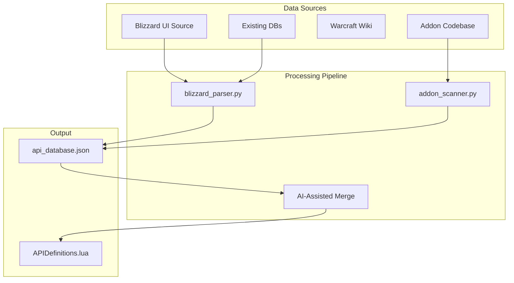

# API Database Automation Plan

This plan outlines multiple approaches to automatically populate the API database with high-quality tests and examples for the !Mechanic API Test Bench.

**Key Decisions**:

- **Scope**: Comprehensive coverage with Midnight-affected APIs in a priority section at top
- **Output**: Two-stage (JSON database -> AI-assisted merge to Lua)
- **Examples**: Mine from downloaded popular addons (no git required)

---

## Data Sources



---

## Approach 1: Blizzard API Documentation Parsing (Primary Source) - READY

**Source**: `_dev_/wow-ui-source-beta/wow-ui-source-beta/Interface/AddOns/Blizzard_APIDocumentationGenerated/` (already cloned)

**Why**: Blizzard provides official Lua documentation files with structured API definitions including parameters, return types, documentation strings, AND **secret value flags** for auto-detecting Midnight impact.

**Key Discovery**: The documentation files contain `SecretArguments`, `SecretReturns`, and `SecretWhen*` flags that directly map to Midnight impact levels.

**Implementation**:

1. Parse ~200+ `*Documentation.lua` files in `Blizzard_APIDocumentationGenerated/`
2. Extract: namespace, function names, parameters (with types, defaults, nilable), returns, documentation
3. Auto-detect Midnight impact from secret flags:

- `SecretReturns = true` -> HIGH impact
- `SecretWhen*` flags -> CONDITIONAL impact  
- `SecretArguments` -> protected call restrictions

4. Map to `APIDefinition` schema

**Actual file structure** (from `SpellDocumentation.lua`):

```lua
local Spell = {
    Name = "Spell",
    Type = "System",
    Namespace = "C_Spell",
    Environment = "All",
    Functions = {
        {
            Name = "GetSpellCooldown",
            Type = "Function",
            SecretArguments = "AllowedWhenUntainted",  -- Midnight flag!
            Arguments = {
                { Name = "spellID", Type = "number", Nilable = false },
            },
            Returns = {
                { Name = "cooldownInfo", Type = "SpellCooldownInfo", Nilable = true },
            },
        },
    },
}
```

---

## Approach 2: Addon Scanning (Real-World Examples)

**Source**: Local addons in `_dev_/` plus downloaded popular addons

**Why**: Shows which APIs are actually used in practice, with real parameter values (spell IDs, item IDs, unit tokens).

**No git required**: Downloaded addon zips work fine - we're just parsing Lua source files.

**Target addons**:

- **WeakAuras** (in workspace) - heavy API user, great for spell/aura examples
- **DBM/BigWigs** - combat event APIs, encounter-specific spell IDs
- **Plater** - nameplate/unit frame APIs
- **ElvUI** - comprehensive UI coverage
- **Details!** - combat log APIs

**Implementation**:

1. Adapt existing `pattern_scanner.py` approach
2. Scan for patterns like `C_Spell.GetSpellCooldown(...)`, `UnitHealth(...)`
3. Extract: function calls with actual arguments used
4. Aggregate frequency data (most-used APIs prioritized)
5. Extract example values with labels where possible

---

## Approach 3: Leverage Existing Databases

**Sources**:

- `api_changes.json` - Already has Midnight-affected APIs with notes
- `.luacheckrc` - Has validated API globals
- Existing `APIDefinitions.lua` - Current manual definitions

---

## Proposed Tool: `APIPopulator`

**Location**: `ADDON_DEV/Tools/APIPopulator/`

**Components**:

| File | Purpose |
|------|---------|
| `blizzard_parser.py` | Parse Blizzard_APIDocumentationGenerated, detect Secret* flags |
| `addon_scanner.py` | Scan addons for API usage and example values |
| `api_database.json` | Intermediate JSON storage (human/AI reviewable) |

**Two-Stage Workflow**:

```powershell
# Stage 1: Generate JSON database
# Step 1a: Parse Blizzard API documentation (primary source)
python APIPopulator/blizzard_parser.py --source "_dev_/wow-ui-source-beta" --output api_database.json

# Step 1b: Enrich with addon examples (after downloading popular addons)
python APIPopulator/addon_scanner.py --database api_database.json --addons "_dev_/ThirdPartyAddons" --output api_database.json

# Stage 2: AI-Assisted Merge
# Review api_database.json, then use AI agent to merge into APIDefinitions.lua
# This provides quality oversight and allows for contextual improvements
```

**Output Organization**:

- **Midnight Section (top)**: APIs with `SecretReturns`, `SecretWhen*`, or `SecretArguments` flags
- **General Sections**: Organized by namespace (C_Spell, C_Item, Unit*, etc.)
- **Examples**: Real values mined from popular addons with source attribution

---

## Database Schema (Intermediate JSON)

```json
{
  "meta": {
    "generated": "2024-12-23T12:00:00Z",
    "sources": ["blizzard_doc", "addon_scan"],
    "wow_version": "12.0.0"
  },
  "categories": [
    { "key": "combat_midnight", "name": "Combat (Midnight)", "priority": 1 }
  ],
  "apis": {
    "C_Spell.GetSpellCooldown": {
      "namespace": "C_Spell",
      "name": "GetSpellCooldown",
      "category": "combat_midnight",
      "params": [
        { "name": "spellID", "type": "number", "nilable": false }
      ],
      "returns": [
        { "name": "cooldownInfo", "type": "SpellCooldownInfo", "nilable": true }
      ],
      "secretFlags": {
        "SecretArguments": "AllowedWhenUntainted"
      },
      "midnightImpact": "HIGH",
      "examples": [
        { "value": 61304, "label": "GCD", "source": "WeakAuras" },
        { "value": 116, "label": "Frostbolt", "source": "manual" }
      ],
      "usageCount": 47
    }
  }
}
```

---

## Recommended Implementation Order

1. **Phase A**: Create `blizzard_parser.py` - Parse all API documentation files
2. **Phase B**: Create `addon_scanner.py` - Mine examples from downloaded addons
3. **Phase C**: AI-assisted merge into `APIDefinitions.lua`
4. **Phase D**: (Optional) Wiki scraper for additional context
5. **Phase E**: (Optional) In-game discovery for validation

---

## Answered Questions

1. ~~**Blizzard UI Source**: Is wow-ui-source already cloned?~~ **YES**: `_dev_/wow-ui-source-beta/`
2. ~~**Scope Priority**~~ **HYBRID**: Comprehensive coverage with Midnight section at top
3. ~~**Output Mode**~~ **TWO-STAGE**: JSON database -> AI-assisted merge